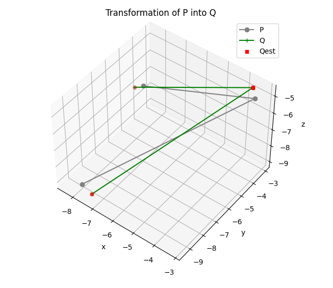

# Homework 1 - Linear Algebra 

### Problem 1

LDU decomposition to solve problem set:
```
python q1.py --do_assert
```

To solve random example:
```
python q1.py --do_assert --random
```

The code verifies the decomposition using ```--do_assert```.

### Problem 2

LDU and SVD decomposition.
```
python q2.py 
```

### Problem 3

Solution of system of equations, checks if the system has zero, one or multiple solutions and provides the solution in the null-space.
```
python q3.py 
```

### Problem 5

Rigid transformation estimation. Provide desired tranformation (all arguments are optional) and the number of points to use (>= 3).
```
python q3.py --x x --y y --z --roll R --pitch P --yaw Y --N n --vis
```

Example:


